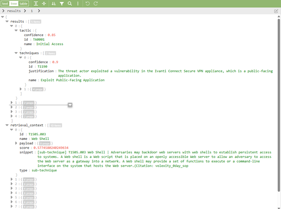
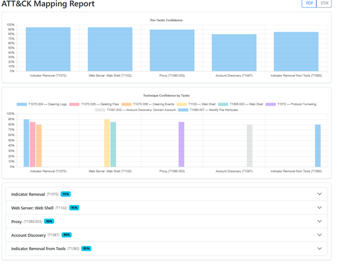

# AWS-RAG-MITRE-ATTACK-UNSWNB15-MAPPER
The goal of this project is to build RAG-powered MITRE ATT&amp;CK Threat Detection System combining machine learning and LLMs to automatically map cybersecurity data to ATT&amp;CK tactics and techniques.  The system analyses UNSW-NB15-formatted network logs and textual threat intelligence to identify and classify adversary behaviors.

## Project Features

- Automated ATT&CK Mapping: Detects and classifies tactics and techniques from network logs and textual intelligence.
- RAG Pipeline: Combines structured feature analysis and semantic retrieval using FAISS and Amazon Bedrock Titan embeddings.
- LLM Reasoning Layer: Uses Nova Micro for context-grounded mapping to MITRE ATT&CK with confidence scoring and justifications.
- Structured + Unstructured Inputs: Structured (UNSW-NB15 CSV logs) and Unstructured (PDF/text reports).
- Flask REST API: Provides /map-csv and /analyse endpoints for machine-readable outputs (JSON/STIX).
- Angular Frontend: Interactive dashboards showing per-tactic confidence charts, justification panels, and STIX export.
- Extensible Knowledge Base: FAISS index built from MITRE ATT&CK JSONL data for high-speed retrieval and model grounding.

## Architecture Overview

- Data Ingestion Layer: Accepts formatted CSV logs and PDF/text reports; pre-processed via csv_net_log_classifier and structured_helpers.
- Feature Extraction & Profiling: Builds class-level profiles summarizing statistical signals and embeddings via Titan.
- Vector Retrieval & Contextualization: Uses FAISS index for semantic retrieval of ATT&CK techniques based on profile embeddings.
- Reasoning & Mapping Layer: LLM (Nova Micro) generates JSON outputs mapping profiles to ATT&CK tactics and techniques.
- Presentation & API Layer: Flask REST APIs serve results; Angular UI visualizes mappings, charts, and STIX exports.

## File and Module Structure

### Backend (Python / Flask)

- main.py: Entry point and API router for the Flask app; integrates structured/unstructured pipelines.
- csv_net_log_classifier.py: Loads PyCaret model to predict attack categories from UNSW-NB15 logs.
- structured_helpers.py: Builds class profiles, performs embeddings, and retrieves ATT&CK docs via FAISS.
- structured_mapper.py: Coordinates structured mapping pipeline through classification, profiling, and LLM reasoning.
- structured_mapper_index_builder.py: Builds FAISS index from ATT&CK knowledge JSONL data for fast retrieval.
- intel_mapper.py: Processes unstructured inputs (PDF/text) for embedding, retrieval, and Nova Micro reasoning.
- intel_mapper_helpers.py: Provides PDF extraction, Titan embedding, FAISS retrieval, and Nova prompt handling.
- shared_and_constants.py: Defines constants, paths, Bedrock configs, and shared utilities.

### Data Assets

unsw_nb15_formated_network_log_tst_part01.csv: Example UNSW-NB15-formatted dataset for testing.

### Core Model Dependencies

- Machine Learning: PyCaret, pandas, scikit-learn
- Embeddings & Retrieval: Amazon Bedrock (Titan, Nova Micro), FAISS, boto3
- PDF Parsing: pdfminer.six
- API Framework: Flask, awsgi2
- Frontend: Angular 17, ng-bootstrap, Chart.js

## Output Examples & Visualization

Sample outputs from structured (CSV) and unstructured (PDF/text) mapping pipelines, with Angular dashboard visuals.

[CSV Mapper Output](visuals/csv_mapper_output_sample.png "Sample classification results from CSV-based network log mapping")

## Deployment Notes

The backend is containerised and deployed using Docker and AWS Lambda to ensure consistent execution across environments. This approach addresses the strict Python versioning and dependency requirements of PyCaret, enabling stable model inference and scalable serverless operation. The Lambda-compatible image allows seamless integration with AWS Bedrock services for Titan embeddings and Nova Micro reasoning.

## References

- **MITRE ATT&CK® Framework.**  
    MITRE Corporation. _Adversarial Tactics, Techniques, and Common Knowledge (ATT&CK)_.  
    <https://attack.mitre.org>
- **UNSW-NB15 Dataset.**  
    Moustafa, N., & Slay, J. (2015). _UNSW-NB15: A comprehensive data set for network intrusion detection systems (UNSW-NB15 network data set)._  
    In _Military Communications and Information Systems Conference (MilCIS)_, IEEE.  
    <https://research.unsw.edu.au/projects/unsw-nb15-dataset>
- **Amazon Bedrock Documentation.**  
    Amazon Web Services. _Amazon Bedrock - Build and scale generative AI applications with foundation models._  
    <https://aws.amazon.com/bedrock/>
- **PyCaret Machine Learning Library.**  
    PyCaret Team. _PyCaret: An open-source, low-code machine learning library in Python._  
    <https://pycaret.org>
- **FAISS: Facebook AI Similarity Search.**  
    Johnson, J., Douze, M., & Jégou, H. (2019). _Billion-scale similarity search with GPUs._  
    _IEEE Transactions on Big Data_, 7(3), 535-547.  
    <https://faiss.ai>
- **pdfminer.six Library.**  
    Community-maintained fork of pdfminer for text extraction from PDFs in Python.  
    <https://github.com/pdfminer/pdfminer.six>
